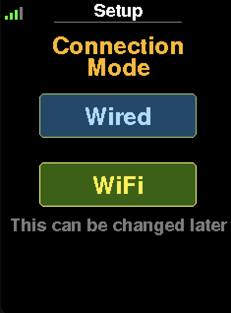
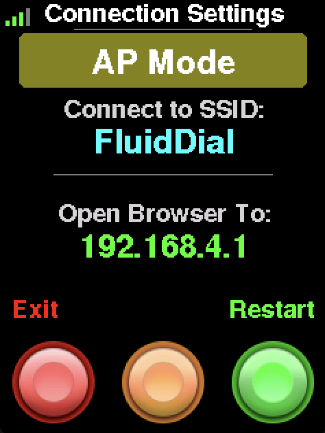
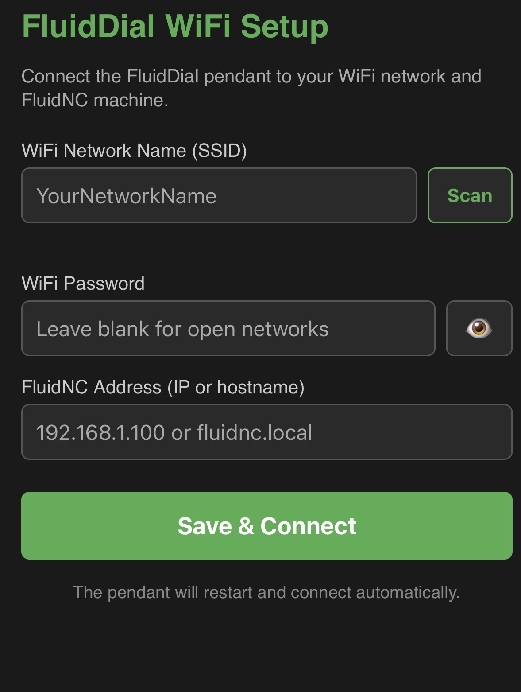
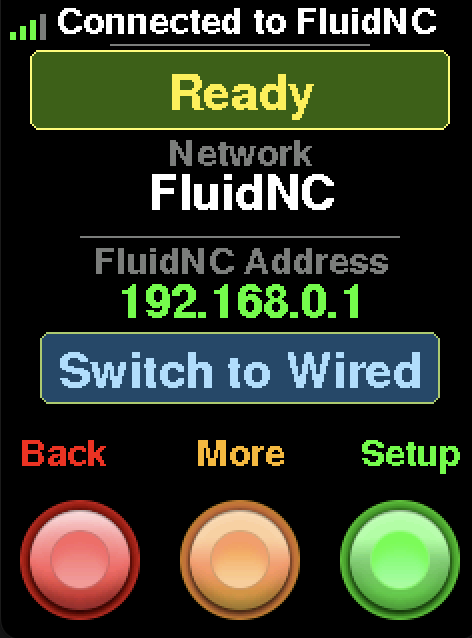
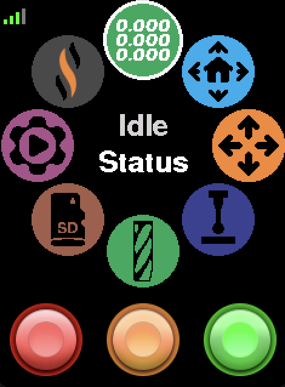
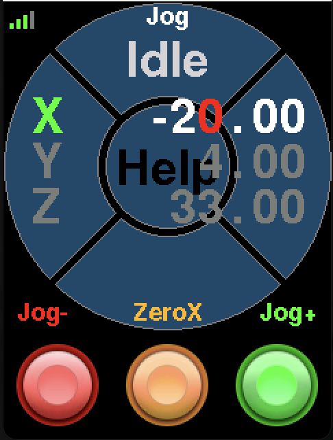
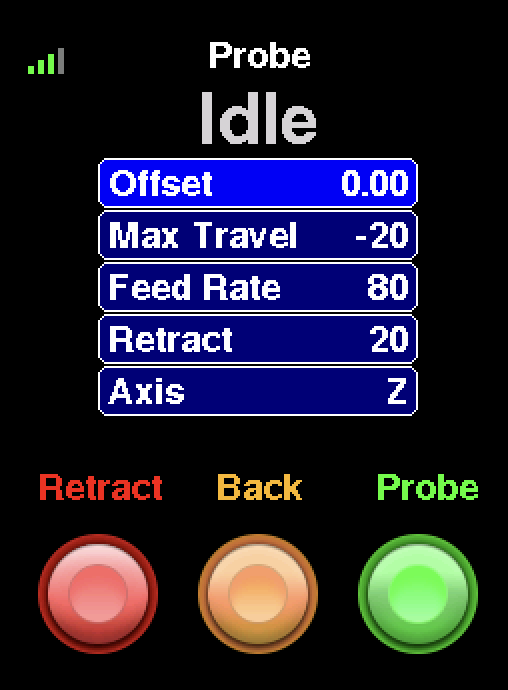

# FluidDial: A Wired/Wireless CNC Pendant for FluidNC Firmware.


Wiki pages for more information: [M5 FluidDial Pendant (left image)](http://wiki.fluidnc.com/en/hardware/official/M5Dial_Pendant) and [CYD Dial Pendant (right image)](http://wiki.fluidnc.com/en/hardware/official/CYD_Dial_Pendant).

Both have similar functionality and similar cost, using different hardware.

## Overview

FluidDial supports two connection modes — **WiFi** and **Wired (UART)** — and is fully compatible with both the **M5Dial** and **CYD** pendant hardware.

In WiFi mode the pendant communicates with FluidNC over WebSockets on your local network. In Wired mode it uses the physical UART serial connection. The active mode is persisted across reboots and can be switched at any time from the Connection Settings screen.

### Features
- **DRO** — real-time X/Y/Z work coordinate display with configurable decimal places
- **Homing** — single-axis or full-machine homing with per-axis status feedback
- **Jogging** — multi-axis jog with encoder control, configurable step size, and one-tap axis zeroing
- **Probing** — Z-probe routine with configurable travel, feed rate, retract, and tool offset
- **SD File** — browse and run G-code files directly from the FluidNC SD card
- **Macros** — store and execute custom G-code macros from the pendant
- **Captive portal setup** — configure WiFi credentials directly from your phone or browser
- **Battery indicator** *(experimental)* — Supported in both M5Dial and CYD versions. *See [this sample project for CYD battery operation](https://github.com/figamore/FigDial)*

---

## Getting Started

### 1. Flash the Firmware

The easiest way to flash FluidDial is with the **[FluidDial Installer](https://installer.fluidnc.com)** — no build tools required. Connect your pendant via USB and follow the on-screen instructions.

### 2. First Boot — Choose Connection Mode

On first boot, the pendant displays a **Connection Mode** setup screen. Tap **Wired** or **WiFi** to choose your transport. This choice is saved and can be changed later from the Connection Settings screen.



### 3. WiFi Setup — Captive Portal

If you selected WiFi, the pendant starts an open access point named **"FluidDial"**.

 

1. Connect your phone or computer to the **FluidDial** Wi-Fi network
2. Open a browser and navigate to **192.168.4.1**
3. The captive portal will appear — scan for your home/shop network and select it
4. Enter your WiFi password and the hostname or IP address of your FluidNC machine
5. Tap **Save** — the pendant will restart, connect to your network, and establish a WebSocket connection to FluidNC

> **Tip:** If connecting to FluidNC's own default AP network, use these defaults:
>
> | Field | Value |
> |---|---|
> | SSID | FluidNC |
> | Password | 12345678 |
> | Hostname | 192.168.0.1 |

> **mDNS:** You can use a hostname like `fluidnc.local` instead of an IP address. The pendant resolves `.local` names automatically via mDNS.

### Connection Settings

The Connection Settings screen shows the current WiFi status and lets you switch modes or reconfigure.

**Connected:**



Shows the connected network name, FluidNC address, and WebSocket status. Press **Setup** (green) to re-enter AP mode if you need to change credentials.

- **Back** (red) — return to the menu
- **More** (orange) — display orientation settings (CYD only), restart, and sleep (M5 dial only)
- **Switch to Wired / Switch to WiFi** button — toggle connection mode and restart

---

## Screens

### Main Menu

The main menu uses a circular pie layout. Each wedge navigates to a function.



### Jog Scene

Displays X/Y/Z work coordinates. The active jog axis is highlighted in green. Rotate the encoder to jog. The red digit shows the currently editable decimal place.



### Probe Scene

Configurable Z-probe routine. All parameters are editable on-screen before running.



| Parameter | Description |
|---|---|
| Offset | Tool length offset applied after probing |
| Max Travel | Maximum distance to travel looking for the probe |
| Feed Rate | Probing speed (mm/min) |
| Retract | Distance to retract after contact |
| Axis | Axis to probe (typically Z) |

---

## Building and Flashing from Source

Requires [PlatformIO](https://platformio.org/). Install the PlatformIO IDE extension for VS Code or use the CLI.

| Environment | Hardware |
|---|---|
| `m5dial` | M5Stack M5Dial |
| `cyddial` | CYD (2432S028) — auto-detects resistive or capacitive touch |

For example, to build and flash the CYD Dial:

```sh
pio run -e cyddial --target upload
```
