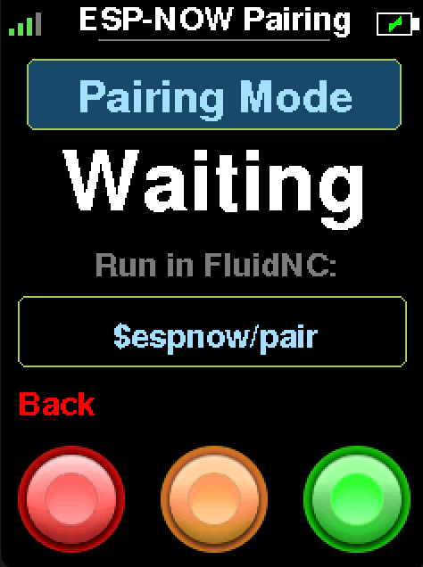
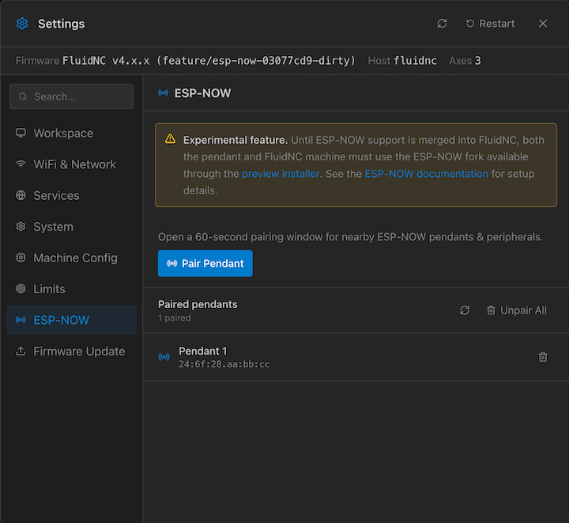
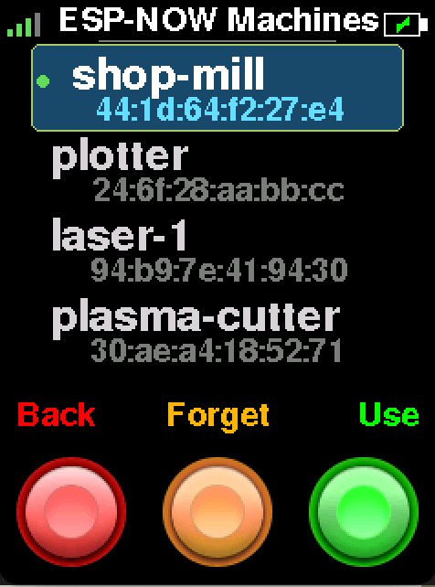

# FluidDial ESP-NOW *(experimental)*

ESP-NOW is a new, optional connection mode for FluidDial that lets the pendant communicate directly with your FluidNC controller over a peer-to-peer encrypted radio link.

Pairing uses P-256 elliptic-curve key exchange and authenticated messages to establish a unique encrypted ESP-NOW key for each pendant and controller.

> **Flash the firmware:** Use the **[ESP-NOW Preview Installer](https://figamore.github.io/FluidDial)** to flash this experimental build onto your M5Dial or CYD pendant, as well as your FluidNC ESP32.

## Contents

- [Why ESP-NOW?](#why-esp-now)
- [Requirements](#requirements)
- [Pairing steps](#pairing-steps)
- [Pairing multiple machines](#pairing-multiple-machines)
- [Encryption and security](#encryption-and-security-overview)
- [Note on Pairing and WiFi mode](#esp-now-pairing-and-wifi-mode)
- [WiFi vs ESP-NOW](#wifi-vs-esp-now---which-should-i-choose)

---

## Why ESP-NOW?

This feature was added in response to user interest in a simpler, potentially more power-efficient wireless option:

- **Flexible pairing** - FluidNC can remember multiple pendants, and a pendant can save multiple machine profiles for quick switching.
- **User demand** - some users want wireless control without setting up a WiFi network or dealing with router configuration.
- **No router required** - the pendant talks directly to the FluidNC controller over a point-to-point encrypted radio link, so it works in any shop environment regardless of network availability.

---

## Requirements

### FluidNC

> **Note:** ESP-NOW requires a matching FluidNC build with ESP-NOW channel support. Because this has not yet been merged upstream, you must currently flash a temporary fork:
>
> **FluidNC fork:** [`figamore/FluidNC` - `feature/esp-now` branch](https://github.com/figamore/FluidNC/tree/feature/esp-now)
>
> This is temporary. Once the ESP-NOW channel implementation is accepted into the main FluidNC repository, a standard FluidNC release will work without any special build.

---

## Pairing steps

1. Flash the [ESP-NOW preview firmware](https://figamore.github.io/FluidDial) onto your pendant.
1. On first boot (or from Connection Settings), select **ESP-NOW** as the connection mode.
1. Leave FluidDial on the **ESP-NOW Pairing** screen.

4. Open a pairing window on FluidNC using one of these methods:
   - In a FluidNC terminal, run `$espnow/pair`.
   - In [FigUI](https://github.com/figamore/gifui), open **Settings > ESP-NOW** and select **Pair Pendant**.
   
1. Wait for FluidDial to connect. Both devices save the pairing automatically.

---

## Pairing multiple machines

FluidDial can save profiles for multiple FluidNC machines. Open **Connection Settings > Machines** to select an existing machine, choose **Pair New** to add another one, or use **Forget** to delete the selected profile from the pendant.

FluidNC also stores its own list of paired pendants. FigUI can list and remove individual pendants or **Unpair All** from **Settings > ESP-NOW**. The equivalent FluidNC terminal commands are:

- `$espnow/list` - list paired pendants and their numeric indexes.
- `$espnow/unpair=<index>` - remove one pendant using the index shown by `$espnow/list`.
- `$espnow/unpair=0` - remove all paired pendants.

Unpairing should be done on **both FluidDial and FluidNC**. Forget the machine on the pendant, then remove that pendant from FluidNC using FigUI or the ESP-NOW terminal commands. Removing only one side leaves a stale saved profile on the other device.

---

## Encryption and security overview

ESP-NOW traffic is not just accepted from any nearby device. FluidNC keeps a saved list of paired pendant MAC addresses, and FluidDial keeps saved machine profiles. A pendant must complete pairing before FluidNC will accept it as a trusted peer.

Pairing is opened only temporarily, either from the FluidNC terminal or from FigUI. During pairing, FluidDial and FluidNC exchange fresh public keys and derive a shared per-pair key. Pairing confirmation packets include HMAC-SHA256 authentication tags, so a random device cannot complete pairing just by copying the packet format.

After pairing, the devices register each other as encrypted ESP-NOW peers using an LMK. ESP-NOW's encrypted peer mode uses the ESP32 WiFi/ESP-NOW security layer for over-the-air encryption.

FluidDial and FluidNC also add a small anti-replay layer above ESP-NOW. Keepalive, realtime, and data packets carry nonce/counter values so stale packets cannot simply be replayed later as valid control traffic.

This protects against casual or accidental cross-connection, packet sniffing, and simple replay attempts.

---

### Note on ESP-NOW Pairing and WiFi Mode

ESP-NOW pairings are tied to the WiFi mode used during pairing because AP and STA modes use different MAC addresses. A pendant paired while FluidNC is in AP mode must be re-paired after switching to STA mode, and vice versa.

---

## WiFi vs ESP-NOW - which should I choose?

| | WiFi | ESP-NOW |
|---|---|---|
| **Router required** | Yes | No |
| **Range** | Limited by your network | ~100 m line-of-sight (ESP32 radio) |
| **Setup complexity** | Moderate (captive portal) | Low (one-command or FigUI pairing) |
| **Network interference** | Shares band with other devices | Dedicated peer channel |
| **Power consumption** | Higher (full WiFi stack) | Potentially lower, but not by much |

**Choose WiFi if:**
- You already have a reliable network in your shop and want the pendant on it alongside other devices.
- You use FluidNC's built-in web UI or other networked tools alongside the pendant.

**Choose ESP-NOW if:**
- You have no router near your machine, or want to avoid network setup entirely.
- You are running the pendant on battery and want to explore lower power consumption.
- You want the simplest possible wireless setup with minimal configuration.
- You want to control multiple machines with a single pendant.
